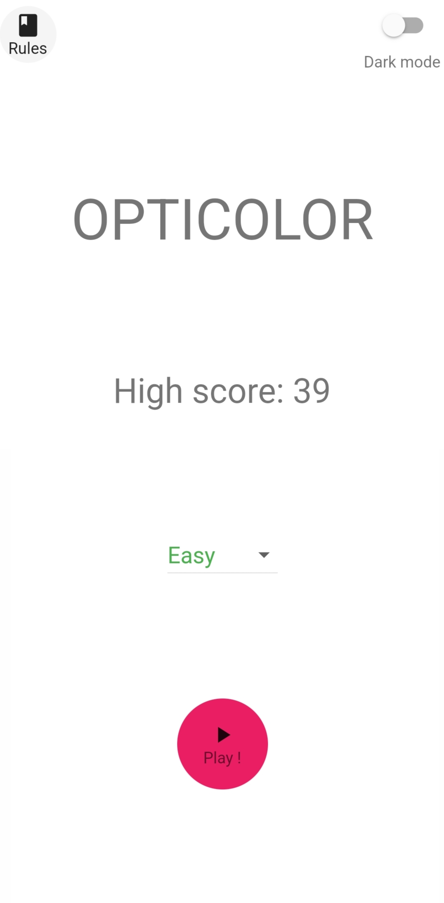
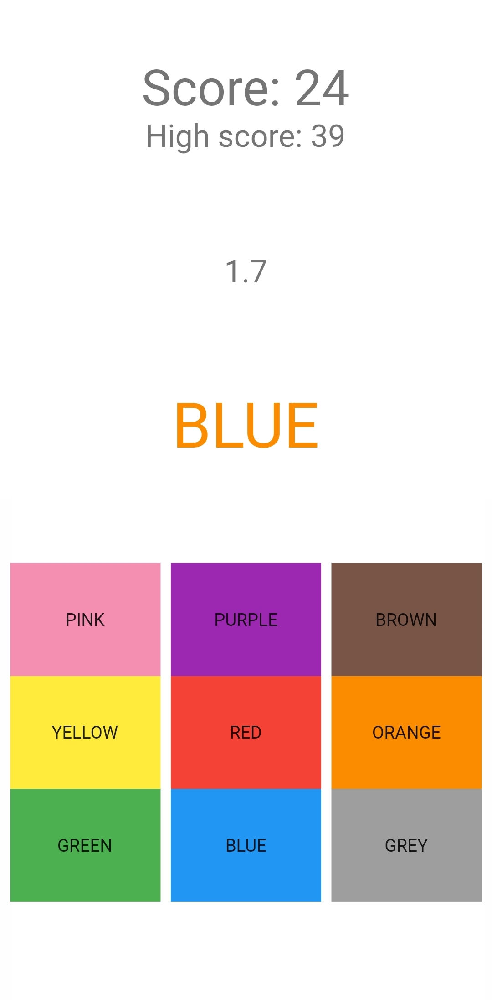
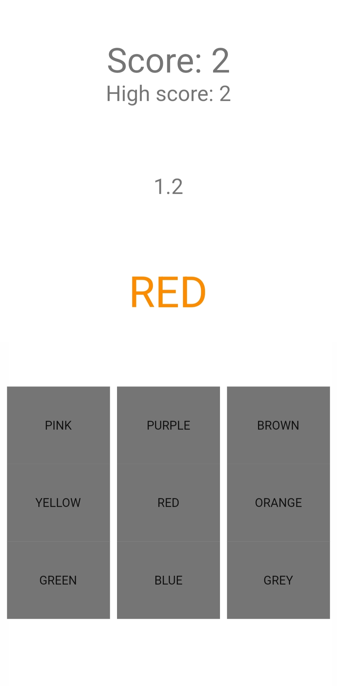

# Opticolor

**Opticolor** is a mobile game inspired by the stroop effect

## **Summarry**

 - [Getting started](#getting-started)
 - [Explanation](#explanation)
 - [Screenshots](#screenshots)
 - [Inspiration](#inspiration)

## **Getting Started**

First, to build and run this app, you'll need to install the **Flutter SDK**.
To install the Flutter SDK, you can follow [this install guide](https://docs.flutter.dev/get-started/install "Install flutter SDK").

Once everything is ready, you'll need to do this command in the project:
\
`flutter pub get`

When it's done, you are ready to run the project.

## **Explanation**

The objective of this game is to press on button corresponding with the color that the text is
without being confused by the word written (and therefor pressing
the wrong button).

This game has 3 difficulty:
 - **The easy difficulty**: You have **5** seconds to press the right button before the timer run out;
 - **The medium difficulty**: You have **3** seconds to press the right button before the timer run out;
 - **The hard difficulty**: You have **2** seconds to press the right button before the timer run out. The buttons are also greyd out to add more difficulty.

## Screenshots
Her are some screenshots of the game:
The main menu              |The game on easy difficulty|The game on hard difficulty
:-------------------------:|:-------------------------:|:-------------------------:
 |  | 

## **Inspiration**

This game is inspired by the stroop effect.
You can get clearer explanation by following this link:

- [Stroop effect (Wikipedia)](https://en.wikipedia.org/wiki/Stroop_effect)

